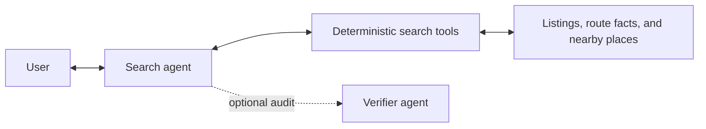

# Casita

[](https://matin.github.io/casita/)

Casita is a personal rental-search tool published as a public repo.

It started as a small script for a time-boxed San Francisco rental search with
two large dogs: scrape Zillow, Craigslist, Zumper, and Redfin; enrich the
listings; rank them; and render a static page that was easier to review than
four open browser tabs.

This is not a product or service. It is published as-is, under MIT, as a
personal-use codebase for an interview loop. The interesting part is what a
candidate chooses to improve.

## Conversational Search Extension

This fork expands Casita from a listing dashboard into a grounded,
multi-turn rental-search assistant. I chose this direction because Casita
already collects the difficult domain data—listing facts, dog policies, route
times, and human preferences—but users still have to translate their needs
into manual filters. Conversational search makes that data easier to use while
preserving Casita's personal, evidence-first design.



The primary agent maps natural language into a typed preference profile. Python
tools—not the model—enforce hard constraints and rank results. This keeps price,
bedroom, dog-policy, amenity, route-time, and nearby-place decisions
reproducible. A separate, optional verifier can audit a drafted answer against
the retrieved evidence without changing the results.

The extension includes:

- Multi-turn search, refinement, comparison, and preference inspection.
- Explicit separation of hard constraints, soft preferences, and unknown facts.
- Walking or driving context for trails, beaches, bakeries, and downtown.
- Attributed offline data for nearby vets, emergency vets, and dog parks.
- Structured session persistence without retaining raw conversation text.
- CLI and local browser interfaces backed by the same agent and tool layer.
- Public evaluation fixtures for interpretation and verifier behavior.

Dog-walker availability remains outside the supported domain because the public
demo does not include a reliable provider dataset. Model-backed interpretation
and verification are optional; the complete core demo remains deterministic,
credentials-free, and usable offline.

## Demo

The demo is credentials-free and uses a sanitized SQLite fixture with cached
route times and precomputed LLM enrichment. It is a deterministic historical
snapshot for evaluating search behavior, not a source of current inventory.
Every conversational result labels its stored price and last-observed date,
and current price or availability must be confirmed at the linked source.

```bash
uv sync
uv run playwright install chromium
uv run casita demo
```

Then open <http://127.0.0.1:8765/>.

Or talk to the credentials-free conversational search agent:

```bash
uv run casita chat \
  --message "Find 2 bedrooms under $5,500 for large dogs" \
  --message "Now I prefer a yard near a dog park" \
  --message "Compare them"
```

For the same agent in a local browser UI, run `uv run casita chat-web` and
open <http://127.0.0.1:8766/>. Named CLI and browser sessions persist only the
structured preference profile, not the raw conversation.

Example prompts:

- `Find 2 bedrooms under $5,500 for large dogs.`
- `Keep them within a 20-minute walk of a trail and near an emergency vet.`
- `Now require a yard and compare the top two.`

With a configured Vertex project, `uv run casita chat-web --llm --verify`
enables broader language interpretation and the optional verifier experiment.

The demo does not scrape, call Vertex, deploy to Firebase, read GCS, or call the
Google Maps Routes API. It does use Playwright's local Chromium browser to
render Open Graph preview images from listing photos and facts. Live `search` /
`enrich` / `publish` paths still exist for private use and are controlled by
environment variables; see `.env.example`.

## What It Does

- Scrapes active rental listings from Zillow, Craigslist, Zumper, and Redfin.
- Normalizes listing facts into SQLite.
- Classifies dog policy and enriches details from listing pages.
- Uses Gemini for fact extraction, photo review, share blurbs, and ranking.
- Computes walking and driving times to curated SF / Marin anchors.
- Renders a static, mobile-friendly site with index and detail pages.
- Records votes and passes so future ranking can learn from reviewer feedback.
- Supports multi-turn natural-language search over grounded listing facts.
- Grounds route-time and nearby veterinary, emergency-vet, and dog-park requests.
- Offers an optional second-agent verifier for Gemini-backed answers.

The domain assumptions are intentionally personal: large dogs, San Francisco
walkability, Marin driving context, trails, beaches, and good bakeries nearby.
That is the point of a personal tool.

## Docs

The [documentation site](https://matin.github.io/casita/) explains the systems
without turning them into assigned tasks. To run it locally instead:

```bash
uv run zensical serve
```

Start at `docs/index.md`, or run `uv run zensical build` to generate the site.

## Checks

```bash
make check
```

This compiles the Python modules, runs the pytest suite, runs the public leak
validator, builds the docs, builds the Python package artifacts, and checks
that the CLI imports.

The conversational layer also has a credentials-free interpretation benchmark:

```bash
uv run casita eval-agent
```

## Contributing

Read `CONTRIBUTING.md`. The short version: fork the repo, pick something you
think makes Casita better, and explain why you chose it.
