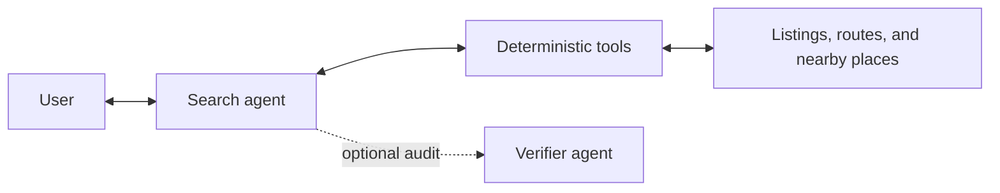

# Conversational Search

Casita's primary agent translates a user's language into a structured
preference profile, calls deterministic search tools, and formats answers from
returned facts. A second verifier agent is optional: it audits the drafted
answer, but cannot alter filters or rankings.



The agent keeps hard constraints such as price, bedrooms, dog policy, and
required amenities separate from soft preferences such as natural light, a
yard, route time, or proximity to a pet service. Hard constraints are enforced
in Python rather than delegated to the language model. Nearby-place answers use
a committed, attributed OpenStreetMap fixture; route answers use cached route
facts. Dog walkers are not included because no reliable provider dataset is
bundled.

The public path is credentials-free:

```bash
uv run casita chat
```

The public fixture is a historical snapshot, not a live inventory feed. Agent
answers and web result cards label stored prices as snapshot values, show when
each listing was last observed, and treat current price and availability as
unverified. External links are presented only as an explicit way to check the
current source.

For an explicit networked run, `casita chat-web --live --headed` reuses the
existing source-search adapters before starting the chat server. The refresh
deactivates every fixture row and enables only listings returned by successful
current rental searches. Empty, blocked, or failed sources contribute nothing;
there is no fallback to their stale fixture rows. The UI labels these results
as observed in a live search and records the observation time. Run `casita
solve` first if Zillow or Redfin requires a human captcha step.

Repeat `--message` for a reproducible multi-turn transcript:

```bash
uv run casita chat \
  --message "Find 2 bedrooms under $5,500 for large dogs" \
  --message "Now I prefer a yard within 20 minutes of a trail" \
  --message "Keep them near an emergency vet" \
  --message "Compare them"
```

Use a named session to retain the structured preference state between runs:

```bash
uv run casita chat --session interview-demo --message "Find 2 bedrooms under $5,500"
uv run casita chat --session interview-demo --message "Now require a yard"
```

The session store intentionally does not retain raw messages. For a local web
interface over the same agent and tool layer, run:

```bash
uv run casita chat-web
```

The offline interpreter covers common rental language. `casita chat --llm`
uses the configured Vertex-backed Gemini model for broader phrasing, but the
model still returns only a typed plan. It does not query SQLite or invent the
answer. If model interpretation fails, the agent falls back to the offline
interpreter.

`casita chat --llm --verify` enables the optional two-agent experiment. The
primary agent interprets the request; the verifier receives only the drafted
answer and retrieved evidence and warns when a claim is stronger than the
evidence. Both model-backed modes require the configured Vertex project. The
offline demo remains credentials-free.

## Boundaries

The agent accepts any message, but it only answers from fields Casita can
retrieve. It labels uncertain facts, such as a listing that allows dogs without
stating a weight limit, and declines unsupported questions such as neighborhood
safety or landlord negotiation likelihood.

## Evaluation

The repository includes public, sanitized interpretation cases:

```bash
uv run casita eval-agent
```

The evaluation checks intent selection, preference state, multi-turn updates,
and unsupported-question detection. `casita eval-agent --llm` runs the same
cases through the configured Gemini interpreter so model and offline behavior
can be compared against one contract.

The optional verifier has a separate benchmark for supported and deliberately
unsupported claims:

```bash
uv run casita eval-verifier
```
